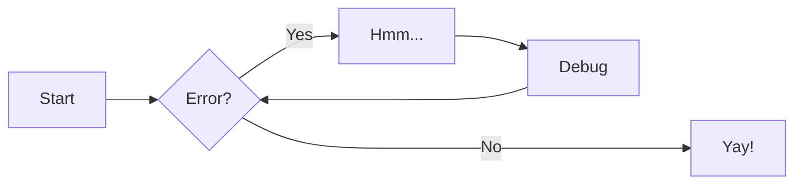
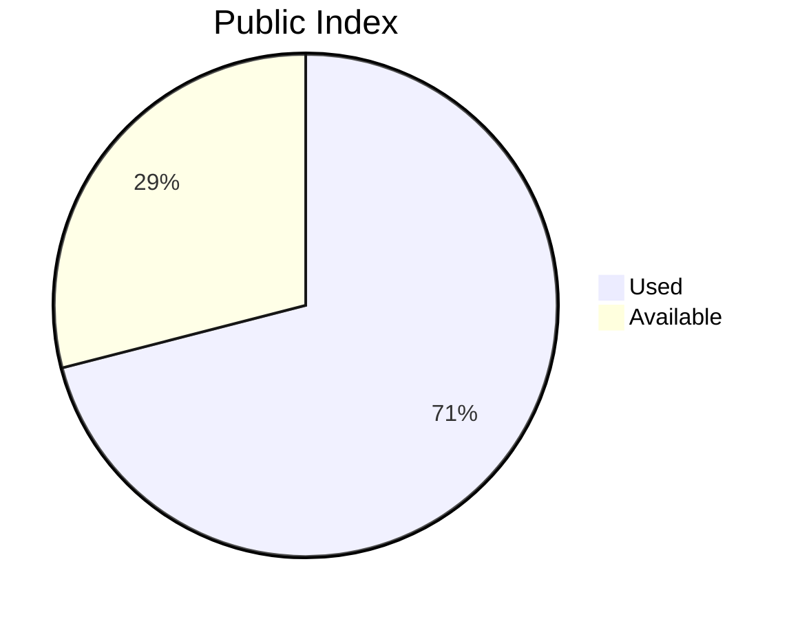
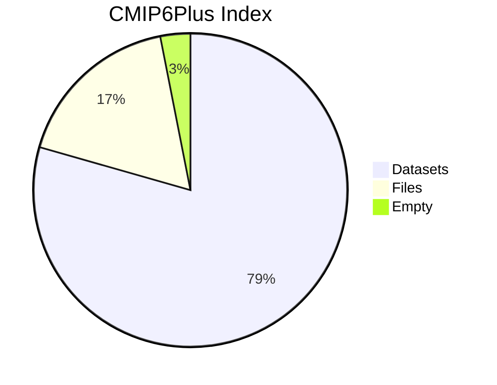
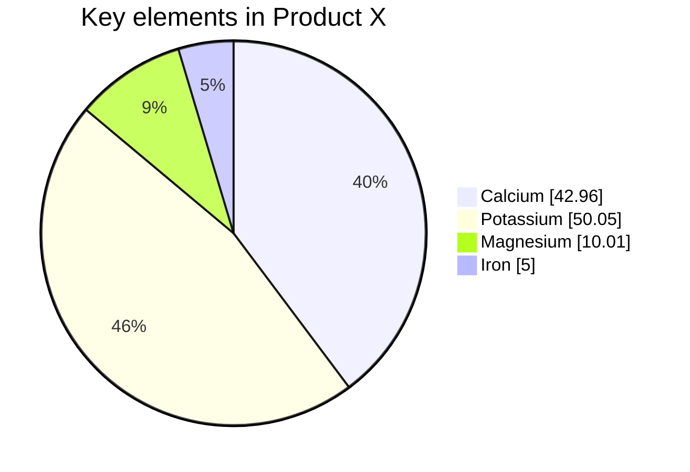

# This is topic 





<div style="display: flex; justify-content: space-between;">


<div style=style="height: 500px;">


</div>


<div style="height: 500px;">

</div>
</div>

??? note "Comparison Diagrams"

    ```mermaid
    pie showData title CMIP6 Dataset
        "ANL" : 5686552
        "LLNL" : 9057750
        "ORNL" : 5963081
        "Imbalance" :  1
    ```

    ```mermaid
    pie showData title CMIP6 File
        "ANL" : 386
        "LLNL" : 85
        "ORNL" : 15
        "Imbalance" : 1
    ```

